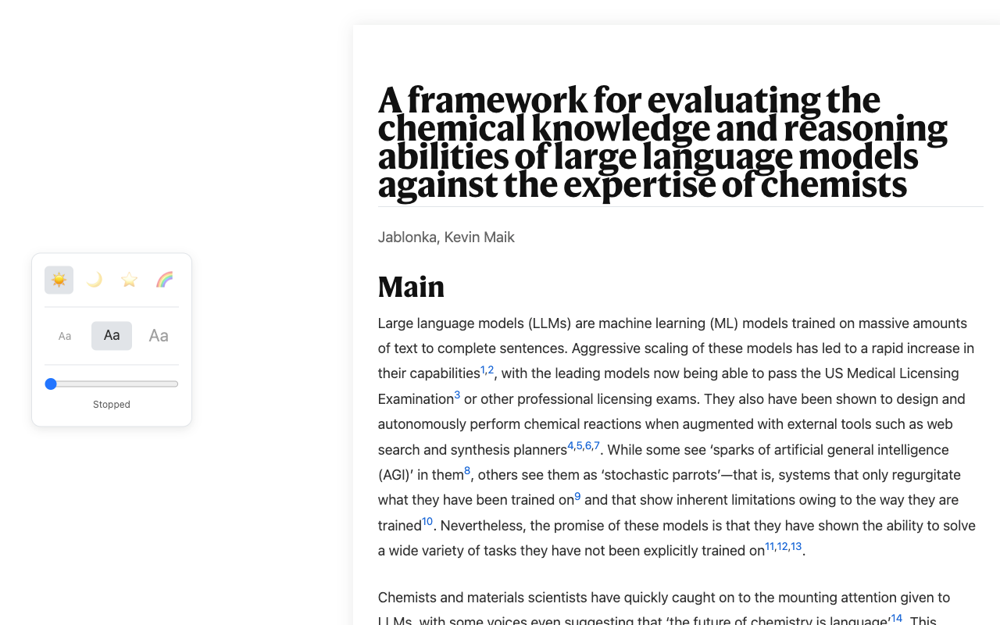

# Read and Scroll Chrome Extension

Read and Scroll is a Chrome extension designed to enhance your web browsing and reading experience. It leverages the power of Mozilla's Readability library to provide a clean, clutter-free reader view of articles and web pages. Additionally, it aims to offer improved scrolling functionalities.

## Features

- **Reader Mode**: Strips away ads, navigation, and other distracting elements from web pages, presenting you with a clean and focused reading view. This is powered by `@mozilla/readability`.
- **Enhanced Scrolling (Conceptual)**: (Details about specific scrolling features would be added here as they are developed, e.g., auto-scroll, custom scroll speed, etc.)
- Built with React, TypeScript, and Vite for a modern and efficient development experience.

## Purpose

The primary goal of Read and Scroll is to make online reading more comfortable and efficient. By decluttering web pages and potentially adding smart scrolling features, users can focus on the content that matters.

## Demonstration

Here's a glimpse of how Read and Scroll transforms a cluttered article into a clean reading experience.

**(Note: Please resize your `before.png` and `after.png` images to approximately 640x400 pixels and place them in an `assets` folder in the project root.)**

**Before Read and Scroll:**

**After Read and Scroll:**

## Installation

(Instructions for loading the extension in Chrome in developer mode, or a link to the Chrome Web Store if published, would go here.)

1. Clone this repository.
2. Navigate to the project directory in your terminal.
3. Run `npm install` to install dependencies.
4. Run `npm run build:dev` to build the extension for development.
5. Open Chrome and navigate to `chrome://extensions`.
6. Enable "Developer mode" using the toggle in the top right corner.
7. Click on "Load unpacked".
8. Select the `dist` directory from the project.

## Development

This project is built using:

- React
- TypeScript
- Vite

### Available Scripts

In the project directory, you can run:

- `npm run dev`: Runs the app in development mode with HMR.
- `npm run build`: Builds the app for production to the `dist` folder.
- `npm run build:dev`: Builds the app in development mode (useful for testing with `manifest.json`).
- `npm run lint`: Lints the project files.
- `npm run zip`: Builds the project and creates a `release.zip` file from the `dist` folder.

## Privacy

This extension processes web page content locally in your browser to provide its features. No browsing data or personal information is collected or transmitted. For more details, please see our [Privacy Policy](PrivacyPolicy.md).
